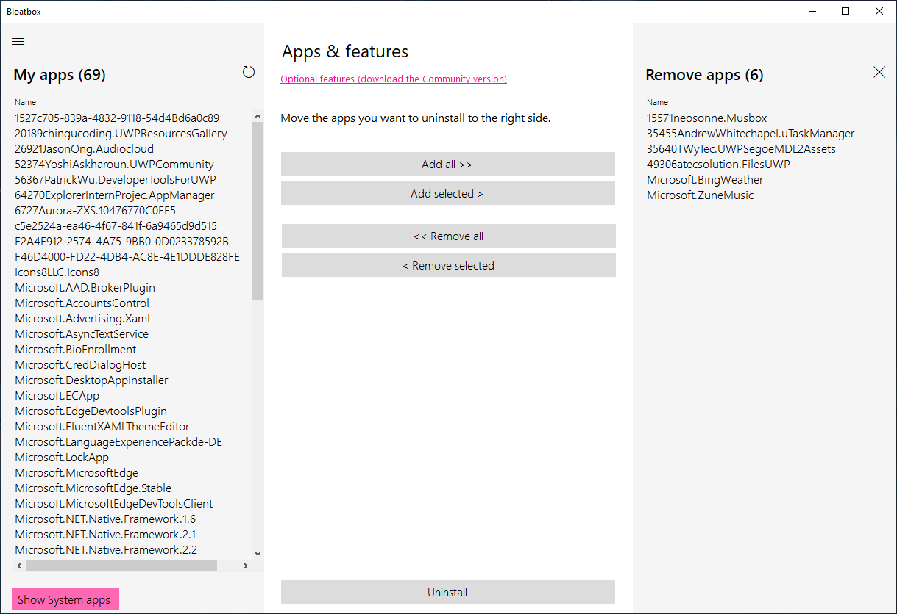

<h1 align="center">
   
  
   
  Keebox
   
</h1>

<h3 align="center">Goodbye, Bloatware!</h3>

	

<a href="https://github.com/andriksantos/keebox/commits/master">

  

    <a href="Contributing.md">Contribution Guide</a>&nbsp;&nbsp;&nbsp;
    

    

    Just type <a href="https://github.com/andriksantos/bloattox"><code>Keebox</code></a> to go here. Check out my <a href="https://andriksantos.github.io/">web</a> and follow me on <a href="https://twitter.com/andrik_rsm">Twitter</a> and <a href="https://github.com/andriksantos/Bloatox/releases">Download</a> this app.
  

---

## About

I know there are a thousand ways to uninstall modern Windows 10 apps. Here is the One Thousand and One with Bloatbox!
This was intended as a small extension for my app [Spydish](https://github.com/builtbybel/spydish) to uninstall specific apps. 
Since I didn't want to bloat Spydish unnecessarily (those who know me know that I am a friend of small apps and lean code), I have now made this available as a standalone app. With the upcoming Spydish release it can be started from within Spydish. 

This code is based on parts of this nice project from [ConditionalException](https://github.com/ConditionalException/Windows10Privacy). Some inspiration has also flowed from this ugly guy [AppManager by Microsoft](https://www.microsoft.com/p/app/9n8b6qf719pt) but on Windows Forms :smirk:

## Download

- (Latest release) [Download](https://github.com/andriksantos/keebox/releases)
- (Mirror on my site) [Download](https://www.andriksantos.com/keebox)
- (Source Code) [Download](https://github.com/andriksantos/keebox/releases) 

## Community package
The community package for Keebox adds support for several advanced scripting features based upon PowerShell, e.g.
- Reinstall of all built-in apps
- Removal of specific pre-installed apps
- Uninstall of OneDrive 
- Unpinning Startmenu tiles 
- Disable of Windows Defender (NOT recommended! I can highly recommend using Windows Defender on consumer versions of Windows 10)
- Blocking telemetry via firewall and host files. Rules are provided by [crazy-max/WindowsSpyBlocker](https://github.com/crazy-max/WindowsSpyBlocker)
			  
#### Check also the [Marketplace for new script files](https://github.com/builtbybel/bloatbox/tree/master/marketplace)
Script files provided for [Spydish](https://github.com/builtbybel/spydish) or my older app SharpApp are fully compatible with Bloatbox. You will find some on my site [here](https://www.builtbybel.com/marketplace)

All scripts included to the latest package can be viewed [here](https://github.com/andriksantos/keebox/tree/master/marketplace)

### How-to Install
* **[Download](https://github.com/andriksantos/keebox/blob/master/marketplace/keebox_pkg-EXTRACT_FIRST.zip?raw=true)** the latest `keebox_pkg.zip` file.
* **Extract the package** to keebox installation directory
* **Restart keebox**

### Intro of community package after Installing

#### This feature is only supported by keebox version 0.14 and higher!

## Credits

This project is partly based upon 

- https://github.com/ConditionalException/Windows10Privacy

This software uses the following packages:

- [Windows10Debloater](https://github.com/Sycnex/Windows10Debloater)
- [Icon by FFra](https://www.deviantart.com/ffra/art/MAXIMAL-Icons-Updated-387287801)

## Crack 
- GitHub [@builtbybel](https://github.com/builtbybel) &nbsp;&middot;&nbsp;
- Twitter [@builtbybel](https://twitter.com/builtbybel)